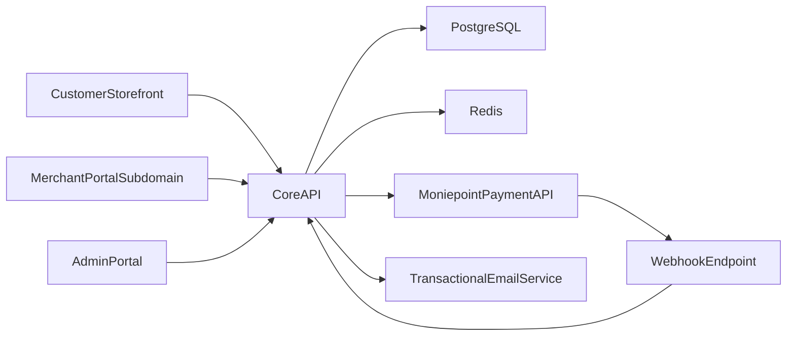

# Sexxy Market Production Implementation Plan

## Product Scope

- Launch a multi-vendor e-commerce platform for `sexxymarket.com` with:
  - Customer storefront (guest + account checkout)
  - Merchant portal on `merchant.sexxymarket.com` (approval-gated onboarding)
  - Admin portal for product/order governance and role-based operations
- Region and business rules:
  - Nigerian market, NGN pricing, free nationwide delivery
  - 18+ professional notice and age-gate confirmation across relevant flows
  - Commission model initially set to 10% platform fee per fulfilled sale

## Proposed Architecture

- Monorepo using Turborepo:
  - Web apps: apps/storefront, apps/merchant-portal, apps/admin-portal
  - API server: apps/api
  - Shared packages: packages/ui, packages/config, packages/types
- Core stack:
  - `Next.js` (App Router) for all web portals
  - `NestJS` API for auth, catalog, orders, merchant workflows, webhooks
  - `PostgreSQL` + `Prisma` ORM
  - `Redis` for rate limiting, session/cache, idempotency guards
  - `S3-compatible object storage` for product media uploads

## Security and Compliance Baseline

- Identity and access:
  - Customer auth (email/password + secure reset)
  - Guest checkout with verified email/phone capture
  - Admin and merchant login with MFA-ready structure and strong password policy
  - RBAC with scoped permissions for multi-admin roles
- OWASP protections:
  - Strict input validation + output encoding
  - IDOR prevention via tenant-aware authorization checks at service layer
  - CSRF protection, secure cookies, session rotation, anti-fixation
  - Rate limiting + bot abuse controls on auth, checkout, and review endpoints
  - Security headers (`CSP`, `HSTS`, `X-Frame-Options`, `Referrer-Policy`)
- App/data hardening:
  - Payment webhook signature verification + idempotency keys
  - Audit logs for admin/merchant sensitive actions
  - Encryption at rest (DB-managed) + TLS in transit
  - Secrets only via environment vaulting (no hardcoded keys)

## Functional Modules

- Catalog and categories:
  - Category tree for toys, magazines, cards, role-play kits, and related items
  - Product variants, stock, pricing, merchant ownership, image galleries
- Checkout and orders:
  - Guest/account cart, shipping address, phone validation, order summary
  - Live payment via Moniepoint payment links (Monnify integration prepared behind provider abstraction)
  - Order statuses: pending, paid, processing, delivered, cancelled, refunded
- Reviews:
  - Only verified buyers can post product reviews after paid/fulfilled order
  - Anti-spam constraints and moderation flags
- Merchant operations:
  - Merchant onboarding with KYC/business profile + agreement acceptance
  - Admin approval workflow before listing activation
  - Merchant product CRUD, inventory, order management views
- Admin operations:
  - Product governance (platform-owned and marketplace listings)
  - Order management dashboard, merchant approvals, dispute flags
  - Role management for multiple admins

## Legal and Professional Content

- Build and display production-grade documents:
  - apps/storefront/app/legal/age-policy/page.tsx
  - apps/storefront/app/legal/privacy/page.tsx
  - apps/storefront/app/legal/terms/page.tsx
  - apps/merchant-portal/app/legal/merchant-agreement/page.tsx
- Merchant agreement to include:
  - 10% commission clause
  - Settlement clause: merchant payout released after delivery confirmation workflow
  - Content/product compliance and prohibited goods clauses

## Deployment and Production Ops

- Deliver production assets in-repo:
  - infra/docker, infra/nginx, infra/terraform
  - [github/workflows](.github/workflows) for CI (tests, lint, build, security scan)
- Runtime operations:
  - Managed Postgres + Redis + object storage
  - Daily DB backups + restore runbook
  - Error monitoring + uptime checks + alerting
  - Structured logging and request tracing

## Delivery Phases

1. Foundation setup (monorepo, auth, RBAC, DB schema, security middleware)
2. Storefront MVP (catalog, cart, guest/account checkout, Moniepoint payment)
3. Merchant portal (onboarding, agreement acceptance, approval, product/order management)
4. Admin portal (product/order/merchant workflows, roles)
5. Security pass (threat checks: authz, IDOR, webhook, rate limit, headers)
6. Production deployment setup (Docker, CI/CD, observability, backup strategy)

## Acceptance Criteria

- Customers can browse, cart, and complete real payment checkout in NGN
- Guest checkout and account checkout both work end-to-end
- Only approved merchants can list/manage products
- Admin can manage products and orders with role-based access
- Verified-purchase-only reviews enforced
- Security controls and logs are active for sensitive endpoints
- Site branding uses provided `Sexxy Market` logo assets across all portals

